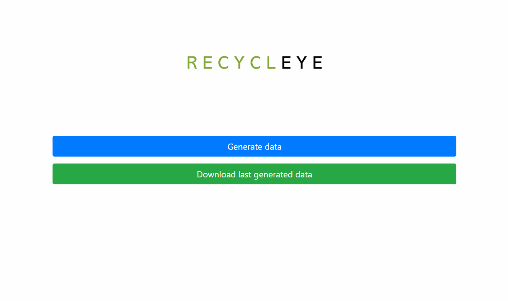
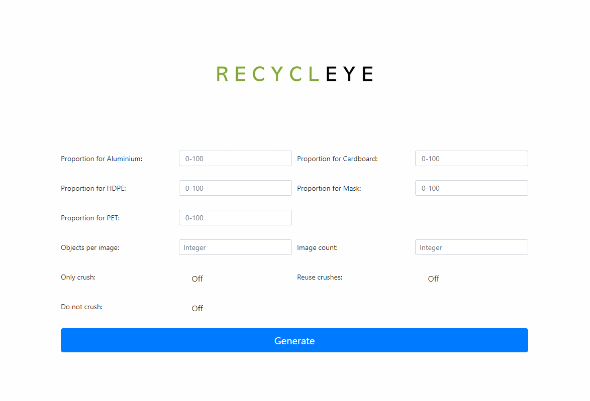
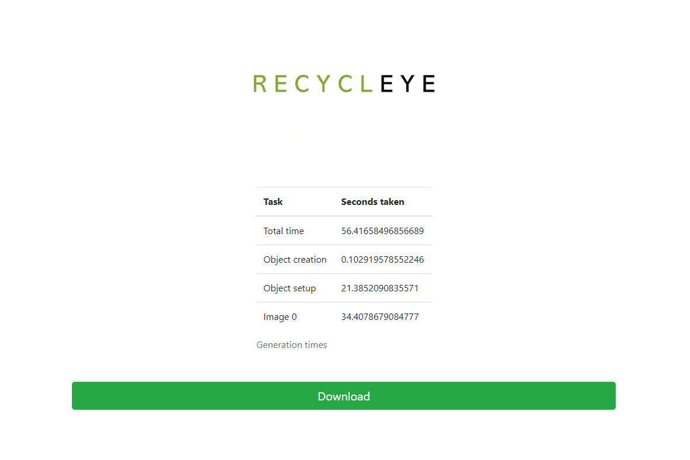

Synthetically generate data for our client Recyleye.

Done together with: 
Liudas Mikalauskas
Simon Mariën
Abel Van Steenweghen
Rahul Kochar

Project plan: https://www.overleaf.com/project/5e9eba0cd86870000192edc4

[](https://sonarcloud.io/dashboard?id=tudelt-project)
[](https://sonarcloud.io/dashboard?id=tudelt-project)
[](https://sonarcloud.io/dashboard?id=tudelt-project)
[](https://sonarcloud.io/dashboard?id=tudelt-project)
[](https://sonarcloud.io/dashboard?id=tudelt-project)
[](https://sonarcloud.io/dashboard?id=tudelt-project)
[](https://sonarcloud.io/dashboard?id=tudelt-project)
[](https://sonarcloud.io/dashboard?id=tudelt-project)

# User guide
A guide for a user with no programming background.

## Running scripts
Scripts are files that execute tasks. There are two scripts in this project that allow the user to run the synthetic data generator:
* [start_server.sh](start_server.sh) - a script that allows for use of the graphical user interface (GUI henceforth)
* [run.sh](run.sh) - a script that runs the generator directly (with no GUI)

The choice comes down to the preference. While passing arguments to `run.sh` is more tricky than filling fields in the GUI, it allows the user to get the desired output with fewer steps. 

### Linux
* Open the terminal (`CTRL` + `ALT` + `T` in Ubuntu)
* Type `cd` + the path you have saved the project into
    * note: if you are running Linux from Windows type `cd ../../mnt` instead of `cd`
* Type `./run.sh` or `./start_server.sh`

### Windows
* Install any Linux distribution from the Microsoft Store (Windows can't run `.sh` scripts)
* Open the installed distribution (this will immediately open the terminal)
* Follow the Linux instructions from step 2.

### Mac
* Open the terminal (you can find it using Finder)
* type `sh` + `run`/`start_server`

__Note: When running these scripts additional applications (e.g. Python, Docker, Flask) may need to be installed.
We won't cover the installation in this guide since it would become too lengthy.
Just follow the instructions provided in the terminal.__

## Using `run.sh`
If the user decides to run the synthetic data generator without the GUI `run.sh` can be used.
Here's how the parameters that control the generated data can be changed:
Open the `run.sh` file in a text editor and edit the text after the part `main.py --`. To input a parameter specify the tag of the parameter, press space and enter the value. Here's the list of parameters that can be altered with explanations and their tags. 
```shell script
usage: blender [-h] [-m MATERIALS [MATERIALS ...]]
               [-p PROPORTIONS [PROPORTIONS ...]] [-c OBJECTS_PER_IMAGE]
               [-i IMAGE_COUNT] [-b BACKGROUND] [-o OUTPUT_LOCATION]
               [-rc REUSE_CRUSHES] [-oc ONLY_CRUSH] [-dc DONT_CRUSH]

Generate synthetic data

optional arguments:
  -h, --help            show this help message and exit
  -m MATERIALS [MATERIALS ...], --materials MATERIALS [MATERIALS ...]
                        a list of materials generated in an image
  -p PROPORTIONS [PROPORTIONS ...], --proportions PROPORTIONS [PROPORTIONS ...]
                        a list of proportions for each material specified
  -c OBJECTS_PER_IMAGE, --objects_per_image OBJECTS_PER_IMAGE
                        number of objects per image
  -i IMAGE_COUNT, --image_count IMAGE_COUNT
                        number of images generated
  -b BACKGROUND, --background BACKGROUND
                        name of background image file
  -o OUTPUT_LOCATION, --output_location OUTPUT_LOCATION
                        path to image directory
  -rc REUSE_CRUSHES, --reuse_crushes REUSE_CRUSHES
                        use existing crushed models instead of creating them
  -oc ONLY_CRUSH, --only_crush ONLY_CRUSH
                        only crush the models of the given material, don't
                        render images
  -dc DONT_CRUSH, --dont_crush DONT_CRUSH
                        don't crush the models
```
## Using `start_server.sh`
If the user decides to run the generator with GUI:
* Execute `start_server.sh` script  as explained in section **running scripts**
* Open your browser and open the link [http://127.0.0.1:5000/](http://127.0.0.1:5000/)

First, you will see this screen:

If you press the button **Generate data** you will be redirected to this screen:

Here using the text fields and buttons you can alter the data in such ways:
* Number of images generated
* Number of objects per image
* Proportions of different materials in images
* Whether you want to crush objects or not
* Whether you want to only crush the models in library or not
* Whether you want to reuse the previously crushes or not

When you press the button **Generate** the data will begin generated and after some time
will be ready for download.

To download the data the download screen is used (accessible from the title screen or after generating data):

Here you can see information about how long different tasks took to complete and download a
folder with the output images.

### Next steps
Now you know how to input something to the generator and get some output from it. However to achieve
good performance with your machine learning model that's not enough. Here are some next
steps that will help you achieve data that is more suited to your needs and the programming
background needed for them:
* **yaml** syntax: this allows you to alter the [configuration](configuration.yaml). Which gives
you the freedom to control camera and lighting in the scene. It also allows you to change the rendering properties
* **yaml** syntax + **Blender**: this allows you to expand the library of models and/or skins. For a
detailed documentation check out: [Blender.md](Documentation/Blender.md), [ModifyLibrary.md](Documentation/ModifyLibrary.md), [Setup.md](Documentation/Setup.md)
